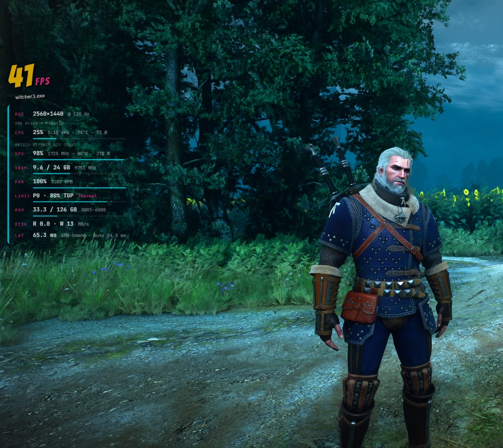
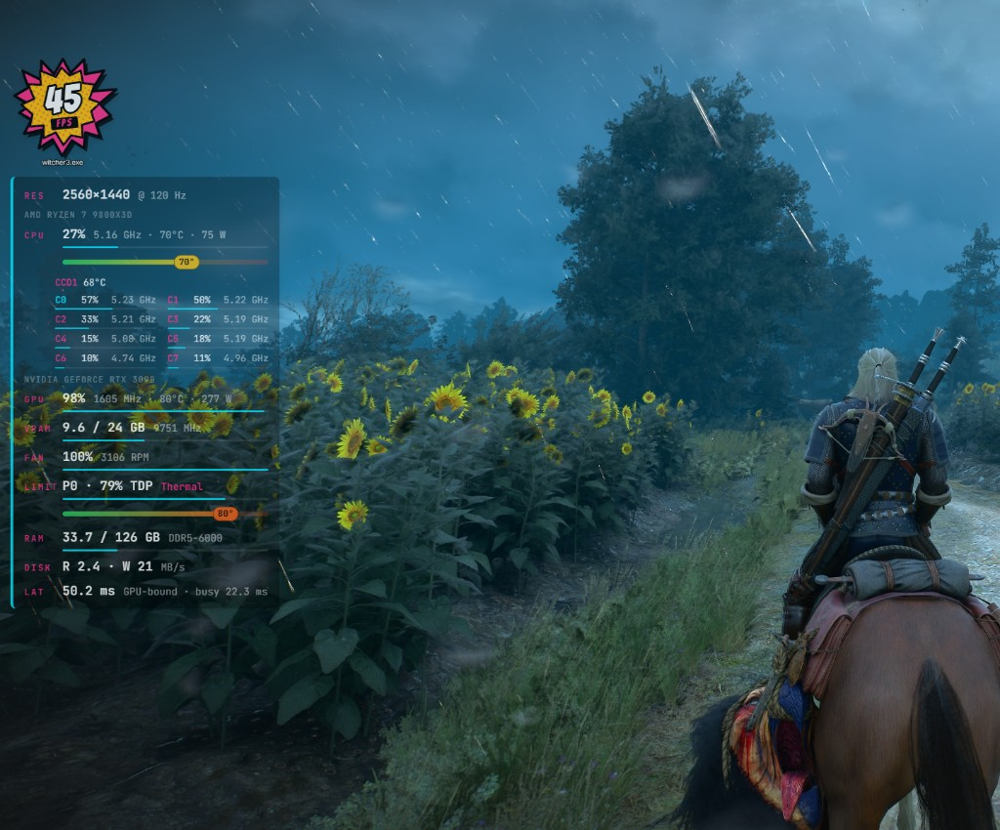
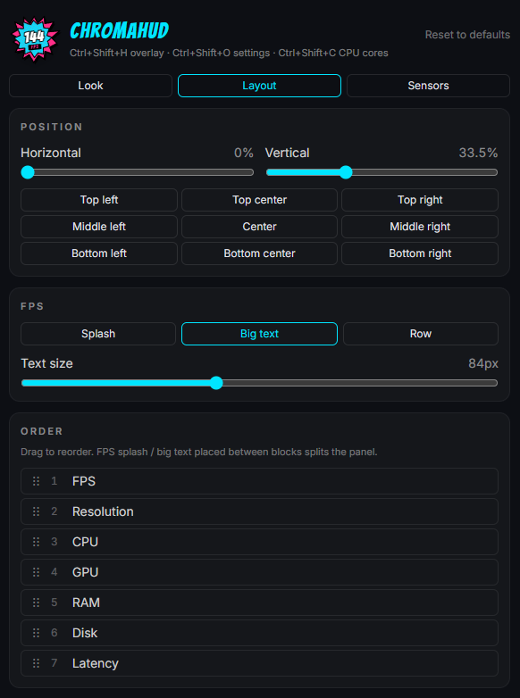
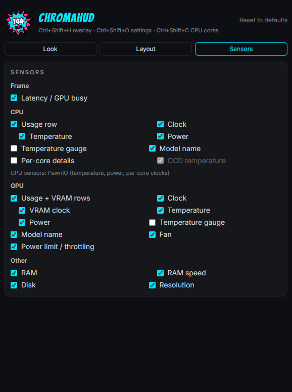

# ChromaHUD

Lightweight, click-through performance overlay for Windows games with a comic-book look.
Built with Tauri v2 (Rust) + React + Vite + TypeScript + Tailwind CSS v4.

> **This project is vibecoded.** It was built almost entirely through conversation with an AI coding
> assistant (Cursor agent): the human described what they wanted, tested it on real hardware and gave
> feedback; the AI wrote the code. Expect rough edges, treat hardware-level parts (driver access,
> sensor decoding) with care, and review before reusing anything in production.

## Download and install

Requires Windows 10 or 11 (64-bit). Pick one of three options:

### Option A: installer (recommended)

1. Open the [latest release](https://github.com/brodatech-lab/ChromaHud/releases/latest).
2. Download `ChromaHUD_<version>_x64-setup.exe` and run it.
3. Windows SmartScreen may say *"Windows protected your PC"* because the app is not code-signed yet.
   Click **More info**, then **Run anyway**.

### Option B: one command

Open PowerShell (no administrator needed) and paste:

```powershell
irm https://github.com/brodatech-lab/ChromaHud/releases/latest/download/install.ps1 | iex
```

To also install the PawnIO driver for AMD CPU temperature, power and per-core clocks:

```powershell
& ([scriptblock]::Create((irm https://github.com/brodatech-lab/ChromaHud/releases/latest/download/install.ps1))) -WithPawnIO
```

The script downloads the latest installer from GitHub Releases, installs it silently and starts ChromaHUD.

### Option C: portable

Download `ChromaHUD_<version>_x64-portable.zip`, unzip it anywhere and run `chromahud.exe`.
Keep `presentmon.exe` in the same folder.

### After installing

- ChromaHUD asks for **administrator rights** every time it starts. Without them there is no FPS and no CPU sensor data.
- It lives in the system tray (bottom-right, next to the clock). Click the icon to open the settings.
- `Ctrl+Shift+H` shows / hides the overlay, `Ctrl+Shift+O` opens settings, `Ctrl+Shift+C` toggles per-core CPU details.
- AMD CPU temperature and power need the free PawnIO driver: `winget install namazso.PawnIO` (or Option B with `-WithPawnIO`).
- Uninstall: **Settings > Apps > Installed apps > ChromaHUD > Uninstall**.

## Screenshots

| Big-text FPS | Splash FPS, temperature gauges and per-core panel |
| --- | --- |
|  |  |

| Layout tab | Sensors tab |
| --- | --- |
|  |  |

## Features

- Transparent, always-on-top, click-through overlay (does not steal focus or mouse input).
- FPS of the foreground app in three styles: comic starburst splash, big comic lettering, or a plain table row.
- Display latency, GPU busy time and a CPU-bound / GPU-bound verdict.
- CPU: usage, effective clock, temperature (Tctl), package power, model name, per-core usage and clocks, CCD temperatures.
- GPU (NVIDIA): usage, core / VRAM clock, temperature, power, VRAM usage, fan % and RPM, P-state, power limit and throttle reason.
- RAM usage and speed (e.g. DDR5-6000), disk throughput, screen resolution and refresh rate.
- Color-changing temperature gauges for CPU and GPU.
- Settings window: colors, panel background and opacity, font and size, position sliders and presets,
  drag-and-drop block order, and a toggle for every single value.

## Metrics sources

| Metric | Source |
| --- | --- |
| FPS, frame time, GPU busy, display latency | PresentMon console sidecar (ETW), needs admin |
| CPU usage, per-core usage, model | sysinfo |
| CPU temperature (Tctl), CCD temperatures, package power, per-core clocks (AMD Zen) | PawnIO driver + signed `AMDFamily17` module, needs admin |
| CPU clock / temperature fallback | PDH `% Processor Performance` + WMI `MSAcpi_ThermalZoneTemperature` (not exposed on every board) |
| RAM usage / speed | sysinfo / WMI `Win32_PhysicalMemory` |
| Disk throughput | PDH `PhysicalDisk(_Total)` counters |
| GPU (NVIDIA) | NVML (`nvml.dll` from the driver); AMD Radeon support is planned |
| Resolution / refresh rate | `EnumDisplaySettingsW` |

## Building from source

### Requirements

- Windows 10/11 x64
- Node.js 20+ and the Rust toolchain (MSVC)
- Optional: [PawnIO](https://pawnio.eu/) driver for AMD CPU temperature, power and per-core clocks

### Third-party binaries

Two files are not stored in the repository and must be downloaded before building:

| File | Download | Save as |
| --- | --- | --- |
| PresentMon console app | [`PresentMon-2.6.0-x64.exe`](https://github.com/GameTechDev/PresentMon/releases/tag/v2.6.0) | `src-tauri/binaries/presentmon-x86_64-pc-windows-msvc.exe` |
| PawnIO AMD module | `AMDFamily17.bin` from [`release_0_2_11.zip`](https://github.com/namazso/PawnIO.Modules/releases/tag/0.2.11) | `src-tauri/resources/pawnio/AMDFamily17.bin` |

PresentMon is bundled as a sidecar and the PawnIO module is embedded into the binary. Without the PawnIO
driver installed the app still runs; CPU temperature, power and per-core clocks fall back to ACPI/PDH and
the settings window shows a "limited" sensor status.

### Develop

```powershell
npm install
npm run tauri dev
```

Run the terminal **as administrator** to get FPS and CPU sensors during development. Release builds request
elevation automatically through the app manifest.

### Release

```powershell
npm run tauri build
```

Pushing a `v*` tag runs [the release workflow](.github/workflows/release.yml): it downloads the third-party
binaries, builds the NSIS installer and a portable zip, and attaches them with `install/install.ps1` to a
draft GitHub release.

## Controls

- `Ctrl+Shift+H` - show / hide the overlay
- `Ctrl+Shift+O` - open settings (also: left-click the tray icon)
- `Ctrl+Shift+C` - expand / collapse per-core CPU details (also: tray menu, settings)
- Tray menu - show/hide overlay, show CPU cores, settings, quit

## Project layout

```
src/                     React frontend (overlay + settings windows share one bundle)
  overlay/               HUD components (FPS splash, big text, stat rows, gauges, cores panel)
  settings/              settings window with Look / Layout / Sensors tabs
src-tauri/src/           Rust backend
  metrics/               collectors: fps (PresentMon), gpu (NVML), cpu_sensors (PawnIO / ACPI), disk, memory, display
  tray.rs, lib.rs        tray menu, global shortcuts, window setup
install/install.ps1      one-command installer (attached to every release)
.github/workflows/       release build (installer + portable zip)
```

## Notes

- The overlay is visible over windowed and borderless-fullscreen games, not exclusive fullscreen.
- If Windows Controlled Folder Access blocks cargo from writing `target/` (e.g. when the project lives on the
  Desktop), point the build directory elsewhere in a local `src-tauri/.cargo/config.toml`:
  ```toml
  [build]
  target-dir = "C:/Users/<you>/AppData/Local/ChromaHUD-target"
  ```

## Third-party components

- [PresentMon](https://github.com/GameTechDev/PresentMon) (MIT) - frame timing via ETW
- [PawnIO](https://github.com/namazso/PawnIO) and [PawnIO.Modules](https://github.com/namazso/PawnIO.Modules) - kernel access for CPU sensors
